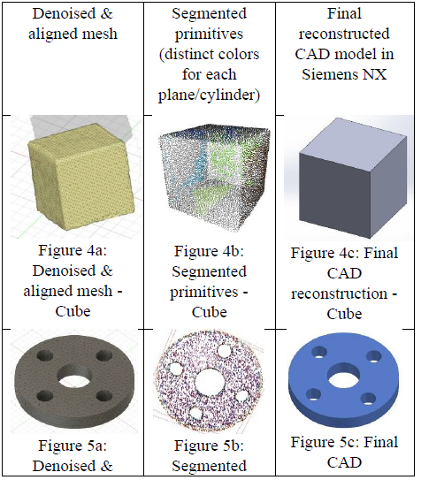
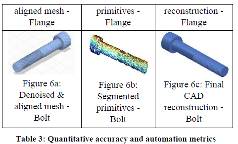
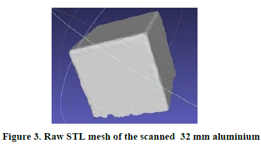

# 🔩 Semi-Automated Reverse Engineering of Mechanical Parts into Parametric CAD Models

> **Independent Research Project | TU Clausthal | Apr – Oct 2025**
> Master Program: Intelligent Manufacturing
> Team: Nikhil Vinayagamurthy, Hithesh Alen D Costa, Neel Deepak Saraf, Tejaswi Armin Manay

---

## 📌 Project Overview

A semi-automated reverse engineering workflow that converts **3D laser scan data** of simple mechanical parts into fully **editable parametric CAD models** in Siemens NX. The pipeline uses classical geometry techniques — **RANSAC fitting** and **normal-based region-growing** — to extract planar and cylindrical primitives from point clouds, and then reconstructs them automatically via the **NX Open Python API**.

Applied to three representative parts (cube, flange, bolt), the method achieves:
- ✅ Dimensional errors **below 0.5 mm**
- ✅ Over **70% of modeling steps fully automated**
- ✅ No machine learning training data required

---

## 🎯 Research Question

> *To what extent can planar and cylindrical primitives extracted from 3D laser scans via RANSAC fitting and normal-based region-growing be reconstructed in Siemens NX as fully parametric CAD models with dimensional error under 0.5 mm, and which stages still require manual intervention?*

---

## 🔧 Six-Stage Pipeline

```
Scan Acquisition → Outlier Removal & ICP Alignment → RANSAC Plane & Cylinder Fitting
       → Region-Growing Segmentation → Parameter Computation → NX Reconstruction
```

| Stage | Tool | Description |
|---|---|---|
| Scan Acquisition | Creaform HandySCAN 3D | High-fidelity point clouds (~0.05 mm spacing) |
| Outlier Removal & ICP Alignment | MeshLab v2020.12 | Noise filtering and multi-view merging |
| RANSAC Plane & Cylinder Fitting | Open3D v0.12 | Geometric primitive extraction |
| Region-Growing Segmentation | Open3D v0.12 | Boundary refinement of detected primitives |
| Parameter Computation | Python | Normal/axis/radius extraction for CAD input |
| NX Reconstruction | Siemens NX 12 + NX Open API | Fully scripted parametric CAD generation |

---

## 💻 Code

### Multi-Plane Detection (`Multi-plane Detection.py`)
Detects multiple planar surfaces from an STL file using **RANSAC segmentation** via Open3D. Each detected plane is assigned a random color for visualization. Outputs plane equations, dimensions, and point counts.

```python
# RANSAC plane detection with Open3D
plane_model, inliers = remaining_cloud.segment_plane(
    distance_threshold=0.01, ransac_n=3, num_iterations=1000
)
```

### Flange Feature Detection (`flange 2.py`)
Extracts all flange geometry from an STL file — outer radius, center bore, bolt hole positions and radii — using **RANSAC circle fitting** and **DBSCAN clustering**.

```python
# RANSAC circle fitting for outer flange boundary
model_robust, inliers = ransac(
    points, CircleModel, min_samples=30,
    residual_threshold=1.0, max_trials=1000
)
```

### RANSAC Dimension Extraction (`using ransac (dimension and pointcloud.py`)
Extracts dimensional parameters from point clouds for downstream CAD scripting.

### NX CAD Reconstruction Scripts
- `cube creation final.txt` — NX Open API script for cube reconstruction
- `flange.txt` — NX Open API script for flange reconstruction
- `m10 final.txt` — NX Open API script for bolt reconstruction

---

## 🖥️ Results

### Workflow Visualization

**Raw STL Mesh → Denoised Mesh → Segmented Primitives → Final CAD Model**



*Reverse engineering workflow: denoised mesh, primitive segmentation (color-coded), and final CAD reconstruction for Cube, Flange, and Bolt*


*Raw STL mesh of the scanned 32mm aluminium cube — starting point of the pipeline*

### Quantitative Accuracy

| Part | Dimensional Error (mm) | % Automated |
|---|---|---|
| **Cube** (32×32×32 mm aluminium) | 0.20 | 80% |
| **Flange** (50mm outer radius, 4 bolt holes) | 0.50 | 75% |
| **Bolt** (M10 Allen, 60mm shank) | 0.25 | 70% |

### Manual Intervention Analysis
- **7 seed-point selections** and **6 occluded-face definitions** recorded across all parts
- Approximately **12 minutes** of total manual input
- Main bottleneck: thread geometry and occluded surfaces on the bolt

---

## 🗂️ Files

| File | Description |
|---|---|
| `Multi-plane Detection.py` | RANSAC multi-plane detection from STL |
| `flange 2.py` | Flange geometry extraction (RANSAC + DBSCAN) |
| `using ransac (dimension and pointcloud.py` | Dimension extraction from point clouds |
| `csv file creation.py` | CSV output for extracted parameters |
| `cube creation final.txt` | NX Open API script — cube CAD reconstruction |
| `flange.txt` | NX Open API script — flange CAD reconstruction |
| `m10 final.txt` | NX Open API script — bolt CAD reconstruction |
| `3_4_flange_1.stl` | STL mesh of scanned flange component |
| `IRP_1B-1_Final_Report_Submission.pdf` | Full research paper (6 pages) |

---

## 📐 Key Algorithms

### RANSAC Parameters Used
| Parameter | Plane Fitting | Cylinder Fitting |
|---|---|---|
| Distance threshold | 0.5 mm | — |
| Radius tolerance | — | 0.2 mm |
| Iterations | 1000 | 1000 |
| Min inlier ratio | 5% | — |

### Region-Growing Parameters
- Normal deviation threshold: **3°**
- Curvature threshold: **0.01**
- Minimum cluster size: **500 points**

---

## 🛠️ Tools & Skills


- Python (Open3D, NumPy, scikit-image, scikit-learn, matplotlib)
- RANSAC plane & cylinder fitting
- Normal-based region-growing segmentation
- Siemens NX 12 + NX Open Python API
- MeshLab (ICP alignment, outlier removal)
- 3D laser scanning (Creaform HandySCAN)
- Parametric CAD modelling

---

## 🏫 Affiliation

**Technische Universität Clausthal**
Master Program — Intelligent Manufacturing
Independent Research Project | Apr – Oct 2025

---

*Full research paper available in `IRP_1B-1_Final_Report_Submission.pdf`*
