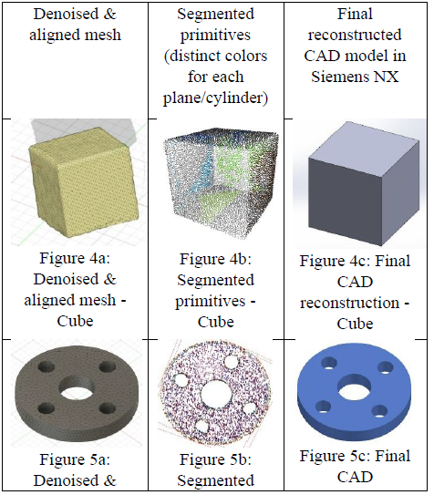
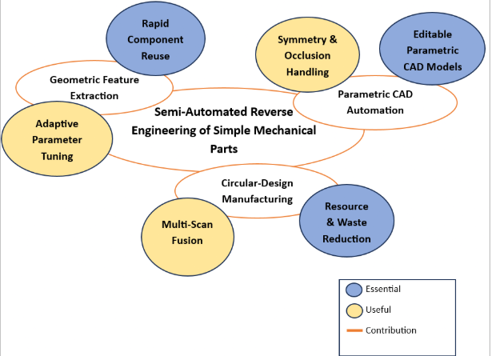
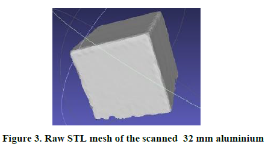
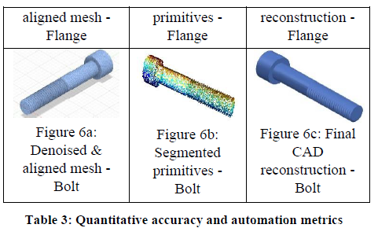
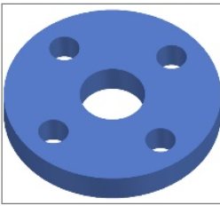

# Semi-Automated Reverse Engineering and Parametric CAD Reconstruction

**6-stage Python pipeline that turns 3D laser scan point clouds of mechanical parts into editable, parametric Siemens NX models, using Open3D RANSAC, region growing and the NX Open API, without any machine learning training data.**


*Denoised mesh, color-coded primitives and final parametric CAD model for the cube, flange and bolt.*

| | |
|---|---|
| **Course** | Interdisciplinary Research Project, Institut für Maschinenwesen, TU Clausthal |
| **Period** | Apr 2025 - Jul 2025, final presentation on 16 July 2025 |
| **Team** | Nikhil Vinayagamurthy, Hithesh Alen D Costa, Neel Deepak Saraf, Tejaswi Armin Manay |
| **My role** | First author of the project paper |

---

## Problem

Reclaiming and remanufacturing used parts needs CAD models, but a laser scan only gives a mesh or point cloud, which is not editable. Tracing a scan into CAD by hand is slow and error-prone. Learning-based tools such as Point2CAD need large annotated datasets and still output non-parametric meshes.

**Research question:** Can planar and cylindrical primitives from 3D laser scans, found with RANSAC and normal-based region growing, be rebuilt in Siemens NX as fully parametric models with a dimensional error under 0.5 mm, and which steps still need manual input?



## Test parts

| Part | Geometry | What it tests |
|---|---|---|
| Cube | 32 x 32 x 32 mm, aluminium | Orthogonal plane fitting |
| Flange | 50 mm outer radius, 15 mm bore radius, four 7 mm bolt holes, 10 mm thick | Planes and cylinders together |
| Bolt | M10 Allen bolt, 60 mm shank, 16 mm head | Sequential cylinder and plane fitting, thread limits |

## Method

1. **Scan acquisition** with a Creaform HandySCAN 3D, about 0.05 mm point spacing.
2. **Outlier removal and ICP alignment** in MeshLab.
3. **RANSAC fitting** of planes and cylinders in Open3D: 1000 iterations, 0.2 mm radius tolerance for cylinders.
4. **Normal-based region growing** to refine primitive boundaries: 3° normal deviation, curvature below 0.01, at least 500 points per cluster.
5. **Parameter computation** in Python: normals, offsets, axes and radii.
6. **Reconstruction in Siemens NX 12** with NX Open Python scripts: datum planes and axes, constrained sketches, extrudes, revolves and Boolean operations.

A 2D alternative was also tested first: measuring the bolt from a smartphone photo with OpenCV. It was fast but had no depth information, so the 3D laser scan was used for the final pipeline.


*Raw STL mesh of the scanned aluminium cube.*

## Results

All three parts were reconstructed **within 0.5 mm of vernier caliper measurements** as editable NX models.

| Part | Dimensional error | Orientation error | Pipeline stages automated |
|---|---|---|---|
| Cube | 0.20 mm | 0.30° | 80% |
| Flange | 0.50 mm | 0.45° | 75% |
| Bolt | 0.25 mm | 0.40° | 70% |

The automation share counts how many of the six stages ran without any manual input. The remaining manual steps were seed point selection for region growing and the definition of occluded faces. The bolt needed the most manual work, because threads and occluded surfaces cannot be detected automatically yet.

| Segmented primitives, bolt | Final NX model, flange |
|---|---|
|  |  |

### Next steps
- Automatic symmetry detection to fill occluded faces
- Multi-view scan fusion
- Parametric thread extraction
- Cones and freeform surfaces

## Repository structure

```
src/detect_planes_ransac.py         multi-plane detection with Open3D RANSAC
src/detect_flange_features.py       outer radius, bore and bolt holes with RANSAC and DBSCAN
src/extract_dimensions_ransac.py    dimensions from the point cloud
src/export_parameters_csv.py        writes parameters to CSV for the NX scripts
nx_journals/cube.py                 NX Open reconstruction of the cube
nx_journals/flange.py               NX Open reconstruction of the flange
nx_journals/bolt_m10.py             NX Open reconstruction of the bolt
data/flange_scan.stl                example scan
docs/IRP_final_report.pdf           project paper
images/
```

## How to run

```bash
git clone https://github.com/Nikhilvinayagamurthy/Reverse-engineering-parametric-CAD.git
cd Reverse-engineering-parametric-CAD
pip install open3d numpy scikit-image scikit-learn matplotlib
python src/detect_planes_ransac.py
python src/detect_flange_features.py
python src/export_parameters_csv.py
```

Set the STL path at the top of each script before running. Then open Siemens NX, choose Tools, Journal, Play, and run the matching script from `nx_journals/` to build the parametric part.

## Tools
Python, Open3D, NumPy, scikit-image, scikit-learn, MeshLab, Creaform HandySCAN 3D, Siemens NX 12, NX Open API

Full paper: [docs/IRP_final_report.pdf](Final_Report.pdf)

---
Technische Universität Clausthal | MSc Intelligent Manufacturing
